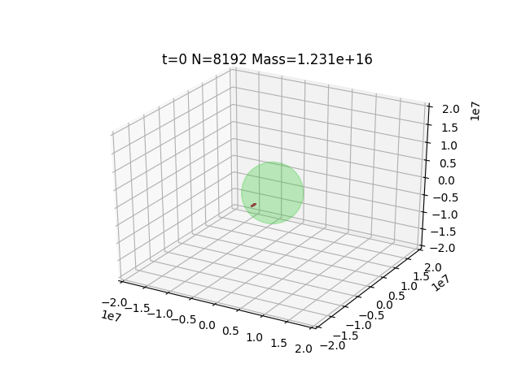

% N-Body Simulation
% Jon Craton
% December 10th, 2019

N-body Simulation
=================

-----

> In physics and astronomy, an N-body simulation is a simulation of a dynamical system of particles, usually under the influence of physical forces, such as gravity (Wikipedia)

Research Question
-----------------

- In October, [we discovered 20 new moons of Saturn](http://www.astronomy.com/news/2019/10/20-new-moons-discovered-orbiting-saturn)
- How does a large body disintigrating on impact form moons or ring systems around a planetoid?

Algorithm
---------

1. Apply gravitational force to each body from every other body - O(N^2)
2. Search for collisions and merge objects - O(N^2)
3. Update positions using new velocity vectors - O(N)

-----



Sequential Implementation
=========================

Pseudocode
----------

```c
for (i = 1; i < N; i++)
  for (j = 0; j < N; j++)
      bodies[i].velocity += {Acceleration from bodies[j]};

for (j = 0; j < N; j++)
  bodies[i].position += bodies[i].velocity * delta_time;
```

Test Hardware
-------------

Component   Model                 Specs
----------  --------------------  -----------------------------------------------
CPU         Intel Core i7-8850H   6 Cores, 12 Threads, 2.6GHz clock
GPU         NVidia P3200          14 Shader Modules, 1792 Shader Units, 6 GB RAM

Performance
-----------

- Consumes resources of 1 CPU core
- Executes in 120 seconds

OpenMP Implementation
=====================

Theory
------

OpenMP gives us a way to make use of additional CPU cores in a shared memory environment

Psuedocode
----------

```c
#pragma omp parallel for private(j)
for (i = 1; i < N; i++)
  for (j = 0; j < N; j++)
      bodies[i].velocity += {Acceleration from bodies[j]};
```

Performance
-----------

- Consumes resources of 12 CPU cores
- Executes in 31 seconds
- Nearly 4x improvement over sequential code

CUDA Implementation
===================

Theory
------

Use paralell processing resources of GPU to improve performance

Pseudocode
----------

```c
__global__ void update_from_gravity (Body * bodies, int * N) {
  int i = blockIdx.x + 1;
  int j = blockIdx.y * blockDim.y + threadIdx.x;
  bodies[i].velocity += {Acceleration from bodies[j]};
```

Performance
-----------

- Consumes no more than 1 CPU core and significant GPU compute
- Executes in 3.8 seconds
- Nearly 32x improvement over sequential algorithm
- Over 8x improvement over OpenMP algorithm
